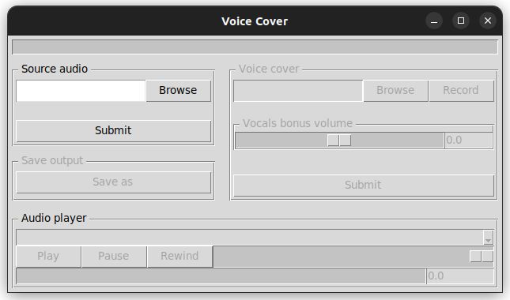

# AI Voice Cover

Python app to replace an audio voice with another one using AI.

AI models:
- [Audio Separator](https://github.com/nomadkaraoke/python-audio-separator) (default model)
- [Coqui.ai TTS](https://github.com/coqui-ai/TTS) (freevc24)

## Usage
### Requirement

- Python > 3.10
- TTS
- Audio Separator
- AudioSegment
- Tkinter

### Makefile

| Command          | Description        |
|------------------|--------------------|
| `make install`   | Install packages   |
| `make uninstall` | Uninstall packages |
| `make run`       | Start project      |
| `make clean`     | Clean project      |